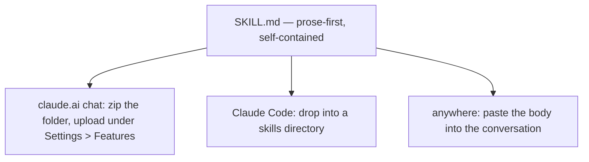

# psychic-plugins

Working discipline as portable skills — **3 skills**, prose-first, extracted from the
psychic-crew program where each ran as enforced law before it became advice. Built for
**claude.ai chat**: no command line anywhere in what ships.

| Skill | What it does |
|---|---|
| `request-contract` | Compile a vague request into a 10-field contract with an observable completion condition and an explicit `unknown_fields` list. |
| `gate-machine` | Run exact-token approval gates as pure ledger discipline: the GATES table, the awaiting→APPROVED stamp ritual, and refusal until the literal token lands. |
| `unknown-audit` | Label every load-bearing claim `[E]`/`[I]`/`[S]` and surface what an artifact assumes without evidence — report, never silently fix. |

**PUBLIC since 2026-08-31** (S1B: full-history scan clean, disclosure ruled, then flipped — see
`GATES.md`). Private at creation.

## Three surfaces, one file

The platform law that shaped this: skills do not sync across surfaces — so the file itself is
the portable unit, and nothing in it assumes a runtime.

## What is not asserted

Nothing mechanical proves a chat-side session follows a skill's discipline — the suite binds
what ships (structure, frontmatter constraints, zero-CLI content), not what a remote surface
does with it. Stated so the green suite is read as what it is.

## Use in claude.ai chat

1. Zip one skill folder (for example `skills/request-contract/`).
2. Upload it under **Settings > Features** (per user; Pro plans and up).
3. Ask in plain words — the skill's description routes it ("turn this request into a contract").

The cross-surface law, quoted from the platform docs: "Custom Skills do not sync across
surfaces." That is why these are prose-first — the same file behaves the same in chat, in
Claude Code, or pasted raw into any conversation.

## Use anywhere prose works

Each `SKILL.md` is self-contained instructions. Paste the body into any Claude conversation and
it works — no install, no wiring, nothing to invoke.

## Verification

`./scripts/validate-plugins.sh` — the platform's frontmatter constraints enforced mechanically
(length, charset, reserved words, XML-free descriptions), doctrine placement, README bindings,
hygiene incl. a stage-everything publication probe, a **zero-CLI-content** assertion over every
shipped skill body (executable shapes: shell fences, mode-bit commands, script-path or
slash-command invocations — proven by a planted fixture), and negative controls proven to fire.
Repo tooling (this validator, the gate guard) is local development machinery and never ships in
a pack — the zero-CLI law governs shipped skill content.
